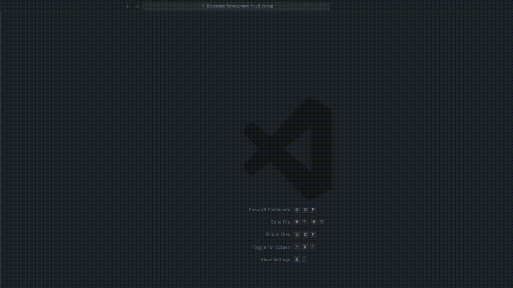

# Spring boot Gradle Plus

[Generic badge](https://img.shields.io/badge/version-0.0.1-critical.svg)

## Overview

This extension tool was inspired by the "Maven for Java" and "Spring Initializr Java Support" apps.

The fact that after using "Spring Boot Initializr" to automatically add dependencies, the only method available for adding more dependencies was copy & paste, plunged me into contemplation (please enlighten me if there's a method I'm unaware of).

Being a notably lazy developer, I pondered over a way to add dependencies directly from within the editor, which led to the creation of this extension tool.

## Features

To open the Command Palette, press `Ctrl+Shift+P` on your keyboard. Then, type "Add dependency" and select "Gradle: Add a Dependency" from the list. This action will prompt the vscode to read the currently specified Spring Boot version from your build.gradle file.

Once the Spring Boot version is detected, a list of available dependencies will be presented at the bottom. You can scroll through this list and choose the dependency you want to add. After selecting the desired dependency, press "OK".

Upon confirmation, the selected dependency will be added to your build.gradle file automatically.

> WARN: Please note that the automatically added dependency statements are based on the dependency information provided by "Spring Initializr". As a result, they may differ from your project's configuration or the guidance provided in official documentation. It's always recommended to review the added dependencies to ensure they align with your project requirements and configurations.

## Requirements

The extension tools are activated only when a "build.gradle" file exists in the workspace. These tools are primarily designed for usage in "Spring Boot" projects configured within a "Gradle" environment.

## Extension Settings

I do not use separate configuration files.

## Known Issues

`lombok` and similar cases involving the addition of multiple dependencies using dependency injection syntax are issues that this extension tool cannot resolve. I am currently in the process of learning "Spring Boot" and have only basic knowledge of "Gradle." If you have any ideas for additional features beyond this functionality, please feel free to suggest them, and I will consider incorporating them.

## Release Notes

### 1.0.0

Initial release
